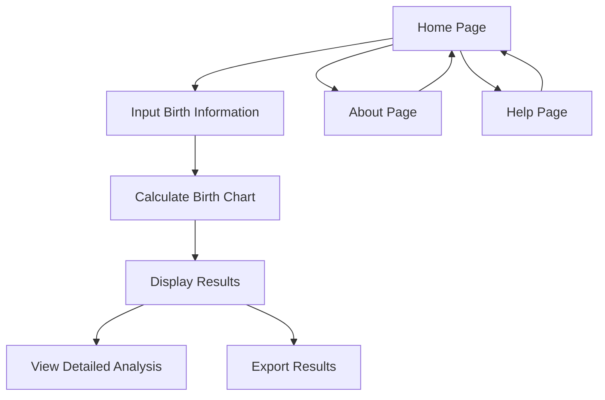

# Birth Chart Calculator - Product Requirements Document

## 1. Product Overview
A comprehensive web-based Birth Chart Calculator that computes Chinese birth charts (生辰八字) and Five Elements analysis based on user's birth date and time, featuring a complete English interface for international accessibility.

The application solves the complexity of manual birth chart calculations by automating the conversion between Gregorian and Chinese lunar calendars, computing the Four Pillars (Year, Month, Day, Time), and providing detailed Five Elements analysis for users interested in Chinese astrology and fortune telling.

Target market includes international users interested in Chinese metaphysics, astrology enthusiasts, and practitioners of traditional Chinese fortune telling who prefer English-language tools.

## 2. Core Features

### 2.1 User Roles
No user registration required - this is a public calculation tool accessible to all visitors.

### 2.2 Feature Module
Our Birth Chart Calculator consists of the following main pages:
1. **Home Page**: hero section with introduction, birth date/time input form, calculation results display
2. **About Page**: explanation of birth charts, Five Elements theory, and how to interpret results
3. **Help Page**: user guide, FAQ, and troubleshooting information

### 2.3 Page Details

| Page Name | Module Name | Feature description |
|-----------|-------------|---------------------|
| Home Page | Hero Section | Display application title, brief description, and key benefits of birth chart analysis |
| Home Page | Input Form | Collect birth date (Gregorian calendar), birth time (24-hour format), and optional timezone selection |
| Home Page | Calendar Converter | Convert Gregorian date to Chinese lunar calendar date automatically |
| Home Page | Four Pillars Calculator | Calculate Year Pillar, Month Pillar, Day Pillar, and Time Pillar using Heavenly Stems and Earthly Branches |
| Home Page | Five Elements Analysis | Analyze the distribution and balance of Wood, Fire, Earth, Metal, and Water elements |
| Home Page | Results Display | Present calculated birth chart in organized table format with detailed explanations |
| Home Page | Export Function | Allow users to save or print their birth chart results |
| About Page | Theory Explanation | Explain the fundamentals of Chinese birth chart system and Five Elements theory |
| About Page | Interpretation Guide | Provide guidance on how to read and understand birth chart results |
| Help Page | User Guide | Step-by-step instructions for using the calculator |
| Help Page | FAQ Section | Address common questions about birth charts and calculation accuracy |
| Help Page | Troubleshooting | Help users resolve input errors and calculation issues |

## 3. Core Process

**Main User Flow:**
1. User visits the home page and reads the introduction
2. User enters their birth date using the date picker
3. User selects their birth time using the time picker
4. User optionally adjusts timezone if born outside their current location
5. User clicks "Calculate Birth Chart" button
6. System converts Gregorian date to Chinese lunar calendar
7. System calculates the Four Pillars using traditional algorithms
8. System analyzes Five Elements distribution
9. Results are displayed in an organized, easy-to-read format
10. User can view detailed explanations by clicking on individual elements
11. User can export or save their results for future reference

## 4. User Interface Design

### 4.1 Design Style
- **Primary Colors**: Deep blue (#1e3a8a) for trust and wisdom, gold accent (#f59e0b) for traditional Chinese elements
- **Secondary Colors**: Light gray (#f3f4f6) for backgrounds, dark gray (#374151) for text
- **Button Style**: Rounded corners with subtle shadows, gradient backgrounds for primary actions
- **Font**: Inter for headings (clean, modern), Source Sans Pro for body text (highly readable)
- **Layout Style**: Card-based design with clean spacing, top navigation with centered content
- **Icons**: Minimalist line icons with traditional Chinese symbols (yin-yang, elements) where appropriate

### 4.2 Page Design Overview

| Page Name | Module Name | UI Elements |
|-----------|-------------|-------------|
| Home Page | Hero Section | Large centered title with gradient text, subtitle explanation, background with subtle Chinese pattern overlay |
| Home Page | Input Form | Clean white card with rounded corners, labeled input fields, modern date/time pickers with validation |
| Home Page | Results Display | Organized grid layout showing Four Pillars in traditional format, color-coded Five Elements with progress bars |
| Home Page | Export Function | Simple download button with icon, print-friendly styling option |
| About Page | Content Layout | Two-column layout with illustrations, expandable sections for detailed explanations |
| Help Page | FAQ Section | Accordion-style collapsible questions, search functionality for quick access |

### 4.3 Responsiveness
Desktop-first design with mobile-adaptive layout. Touch-optimized input controls for mobile devices, with larger tap targets and simplified navigation. Responsive grid system ensures optimal viewing on tablets and smartphones while maintaining full functionality.