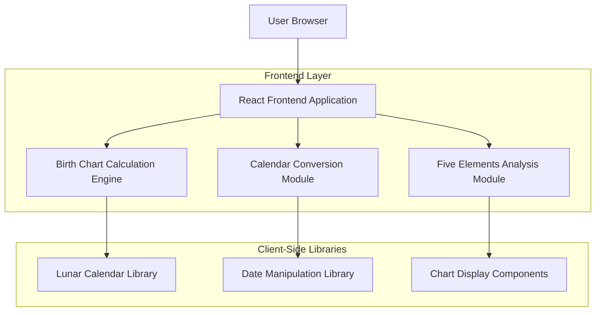
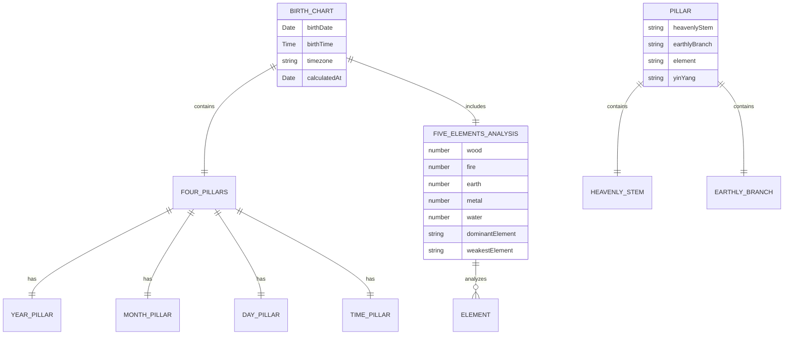

# Birth Chart Calculator - Technical Architecture Document

## 1. Architecture Design



## 2. Technology Description

- Frontend: React@18 + TypeScript@5 + Vite@5 + Tailwind CSS@3
- Libraries: date-fns for date manipulation, lunar-calendar-js for Chinese calendar conversion
- UI Components: Headless UI for accessible components, Heroicons for icons
- Build Tools: Vite for fast development and optimized builds
- Backend: None (pure client-side application)

## 3. Route Definitions

| Route | Purpose |
|-------|---------|
| / | Home page with birth chart calculator and results display |
| /about | Information about birth charts and Five Elements theory |
| /help | User guide, FAQ, and troubleshooting information |

## 4. Core Calculation Modules

### 4.1 Calendar Conversion Module

Handles conversion between Gregorian and Chinese lunar calendar systems.

**Key Functions:**
- `convertToLunar(gregorianDate: Date): LunarDate`
- `calculateSolarTerms(year: number): SolarTerm[]`
- `getChineseYear(lunarDate: LunarDate): ChineseYear`

### 4.2 Birth Chart Calculation Engine

Computes the Four Pillars using traditional Chinese algorithms.

**Key Functions:**
- `calculateYearPillar(lunarDate: LunarDate): Pillar`
- `calculateMonthPillar(lunarDate: LunarDate): Pillar`
- `calculateDayPillar(lunarDate: LunarDate): Pillar`
- `calculateTimePillar(birthTime: Time, dayPillar: Pillar): Pillar`

### 4.3 Five Elements Analysis Module

Analyzes the distribution and relationships of the Five Elements.

**Key Functions:**
- `analyzeFiveElements(pillars: Pillar[]): ElementAnalysis`
- `calculateElementStrength(element: Element, pillars: Pillar[]): number`
- `findElementRelationships(elements: Element[]): Relationship[]`

## 5. Data Model

### 5.1 Data Model Definition



### 5.2 TypeScript Type Definitions

```typescript
// Core Types
interface BirthChart {
  birthDate: Date;
  birthTime: string;
  timezone?: string;
  lunarDate: LunarDate;
  fourPillars: FourPillars;
  fiveElementsAnalysis: FiveElementsAnalysis;
  calculatedAt: Date;
}

interface LunarDate {
  year: number;
  month: number;
  day: number;
  isLeapMonth: boolean;
  chineseYear: string;
  zodiacAnimal: string;
}

interface FourPillars {
  yearPillar: Pillar;
  monthPillar: Pillar;
  dayPillar: Pillar;
  timePillar: Pillar;
}

interface Pillar {
  heavenlyStem: HeavenlyStem;
  earthlyBranch: EarthlyBranch;
  element: Element;
  yinYang: 'Yin' | 'Yang';
  chineseCharacters: string;
  englishName: string;
}

interface HeavenlyStem {
  index: number;
  chinese: string;
  english: string;
  element: Element;
  yinYang: 'Yin' | 'Yang';
}

interface EarthlyBranch {
  index: number;
  chinese: string;
  english: string;
  zodiacAnimal: string;
  element: Element;
  timeRange: string;
}

interface FiveElementsAnalysis {
  elements: {
    wood: ElementInfo;
    fire: ElementInfo;
    earth: ElementInfo;
    metal: ElementInfo;
    water: ElementInfo;
  };
  dominantElement: Element;
  weakestElement: Element;
  balance: 'Balanced' | 'Imbalanced';
  recommendations: string[];
}

interface ElementInfo {
  count: number;
  strength: number;
  percentage: number;
  sources: string[];
}

type Element = 'Wood' | 'Fire' | 'Earth' | 'Metal' | 'Water';

// Calculation Input Types
interface CalculationInput {
  birthDate: Date;
  birthTime: string;
  timezone?: string;
}

// Component Props Types
interface BirthChartFormProps {
  onCalculate: (input: CalculationInput) => void;
  isLoading: boolean;
}

interface ResultsDisplayProps {
  birthChart: BirthChart;
  onExport: () => void;
}

interface PillarDisplayProps {
  pillar: Pillar;
  pillarType: 'Year' | 'Month' | 'Day' | 'Time';
}

interface FiveElementsChartProps {
  analysis: FiveElementsAnalysis;
}
```

## 6. Algorithm Implementation

### 6.1 Heavenly Stems and Earthly Branches

The application uses traditional Chinese algorithms to calculate the Heavenly Stems (天干) and Earthly Branches (地支):

**Heavenly Stems Calculation:**
```
Year Stem = (Year - 4) % 10
Month Stem = (Year Stem × 2 + Month) % 10
Day Stem = Based on perpetual calendar calculation
Time Stem = (Day Stem × 2 + Time Period) % 10
```

**Earthly Branches Calculation:**
```
Year Branch = (Year - 4) % 12
Month Branch = Based on solar terms and seasons
Day Branch = Based on perpetual calendar calculation
Time Branch = Time period (2-hour intervals)
```

### 6.2 Five Elements Distribution

Each Heavenly Stem and Earthly Branch corresponds to one of the Five Elements:
- **Wood**: 甲(Yang Wood), 乙(Yin Wood), 寅(Tiger), 卯(Rabbit)
- **Fire**: 丙(Yang Fire), 丁(Yin Fire), 巳(Snake), 午(Horse)
- **Earth**: 戊(Yang Earth), 己(Yin Earth), 辰(Dragon), 戌(Dog), 丑(Ox), 未(Goat)
- **Metal**: 庚(Yang Metal), 辛(Yin Metal), 申(Monkey), 酉(Rooster)
- **Water**: 壬(Yang Water), 癸(Yin Water), 亥(Pig), 子(Rat)

### 6.3 Calendar Conversion Algorithm

The application implements the traditional Chinese calendar conversion algorithm that accounts for:
- Solar terms (24 seasonal markers)
- Leap months in the lunar calendar
- Time zone adjustments
- Historical calendar variations